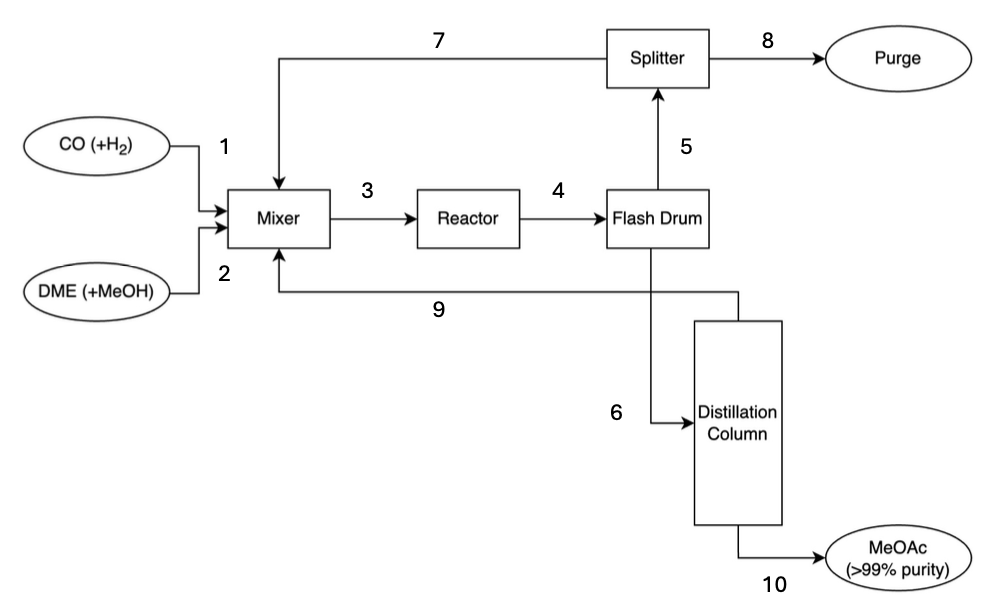
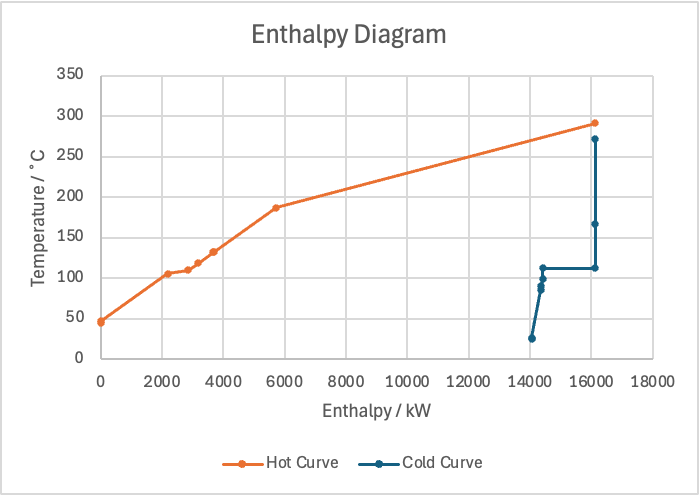
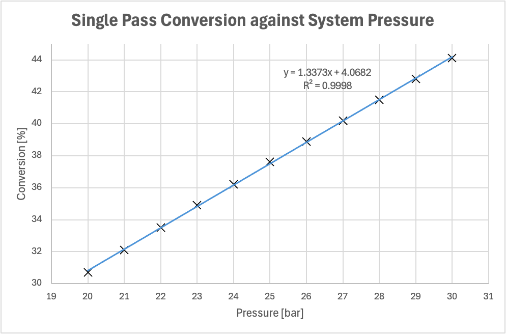
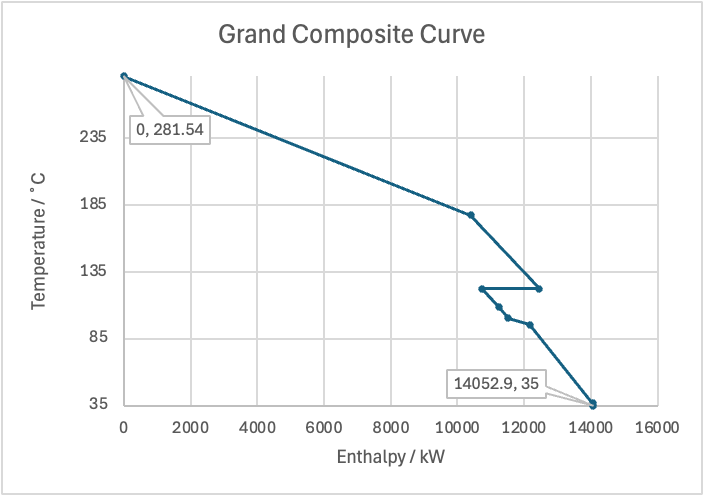
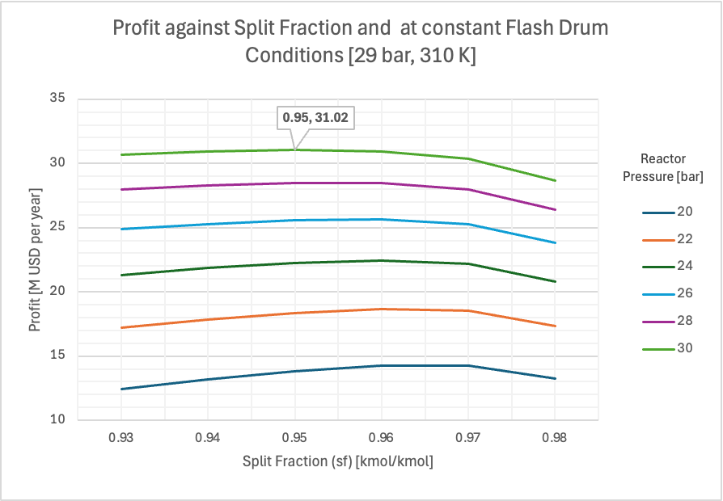
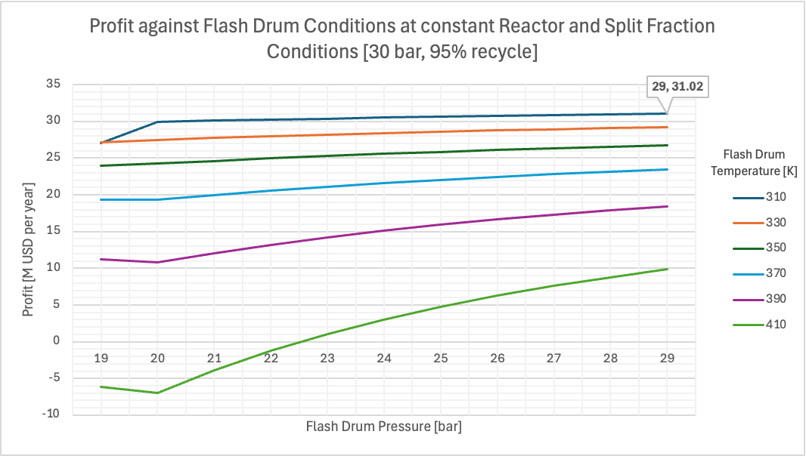

# Level 4 Douglas Process Model

The `MeOAc-PD` repository contains a GAMS implementation of a process and cost analysis for the Level 4 Douglas chemical synthesis train. The optimisation problem in `main.gms` targets profit maximisation for a flowsheet that converts dimethyl ether (DME) and carbon monoxide (CO) into methyl acetate (MeOAc) via a reactor, flash drum, distillation column, compressor network and recycle loop. The model explores operating windows for key design variables and reports optimal economic performance together with resulting stream flow rates.

<em>Block flow diagram showing the MeOAc production sequence of feeds, reactor, flash drum, distillation, recycle and product handles modelled in `main.gms`.</em>

## Problem Scope
- **Objective**: Maximise annual profit by adjusting fresh feed flow rate `FR('F1')`, distillation recovery `r`, flash drum operating conditions (`Flash_P`, `Flash_T`) and reactor pressure `Reactor_P`.
- **Approach**: Non-linear programming (NLP) model solved iteratively across a grid of design variables, recalculating conversion and phase-equilibrium data each iteration.
- **Output**: Detailed table of profit, key operating variables and product flow rate for feasible optimum solutions; optional post-processing run to display full stream compositions.

## Sets and Indices
- **Components (`c`)**: `H2`, `CO`, `DME`, `MeOAc`, `MeOH`. Subset `cl(c)` captures light-key components (`CO`, `H2`) for the column.
- **Streams (`s`)**: Fresh feeds (`F1`, `F2`), reactor inlet/outlet (`Rin`, `Rout`), flash drum phases (`V`, `L`), recycle loop (`Recycle`, `Purge`), product draw (`Product`), and distillation overhead (`DCTop`).
- **Coefficients (`coeff`)**: `A`, `B`, `C` indices for Antoine correlations.

## Decision Variables
- **Flow Variables**: `n(s,c)` component molar flows and `FR(s)` total stream flowrates.
- **Phase Compositions**: `x(c)`, `y(c)`, `z(c)` for liquid, vapour and feed to the flash drum.
- **Unit Performance**: Reactor extent `xi`; distillation recovery factor `r` bounded between 0.9 and 0.998; compressor work variables `C1Work`–`C4Work`; aggregate economics `profit`, `MAT`, `UNIT`, and unit costs `DCCost`, `FDCost`, `RCost`, `CCost`, `CWCost`.

## Parameters and Data
- **Operating Conditions**: Reactor pressure `Reactor_P`, flash drum temperature `Flash_T`, pressure `Flash_P`, splitter fraction `sf`.
- **Stoichiometry**: `nu(c)` for reaction `DME + CO → MeOAc`.
- **Thermophysical Data**: Antoine coefficients `Ant(c,coeff)` generate component vapour pressures `pstar(c)` and relative volatility `RV`.
- **Economic Data**: Stream values (`CostFG`, `CostFL`, `PriceP`), operating hours `OPTime`, and compressor gamma function `gfunc`.

<em>Composite enthalpy profile highlighting heating and cooling demands that inform the model’s energy balance and utility assumptions.</em>

## Model Constraints
- **Feed Specifications**: Fixed zero components and composition constraints for feeds `F1` and `F2`, including single-pass conversion relation `spcdef` linking `xi` and `n('Rin','DME')`.
- **Mass Balances**: Mixer, reactor, splitter, flash drum, and distillation column balances enforce conservation of component flows.
- **Phase Equilibrium**: Flash drum equations enforce compositions summing to unity and apply Raoult’s law using temperature-dependent `pstar(c)` values.
- **Distillation Performance**: Recovery constraints split heavy and light keys between top and bottom products while enforcing specified purities (e.g., `purity` requiring ≥99% MeOAc in product, zero impurities for specific components).
- **Splitter Operation**: `splitfrac(c)` routes the vapour stream `V` between recycle and purge based on fraction `sf`.

<em>Calculated single-pass conversion versus reactor pressure, validating the pressure-dependent SPC relation implemented in the constraints.</em>

## Economic Model
- **Unit Costs**: Empirical correlations calculate distillation (`DCCosteq`), flash (`FDCosteq`), reactor (`RCosteq`) and compressor (`CCosteq`) costs.
- **Material Profit**: `matnetprof` combines product revenue with feed costs over annual operating hours.
- **Compressor Work**: `C1Workeq`–`C4Workeq` estimate individual compressor duties using thermodynamic relations, aggregated into annualised energy cost `CWCosteq`.
- **Overall Objective**: `profiteq` maximises `profit = MAT - UNIT`.

<em>Grand composite curve clarifying feasible heat-integration targets underpinning the economic evaluation of utilities.</em>

## Optimisation Workflow
- **Nested Loops**: The script sweeps `sf` (0.93–0.99), `Reactor_P` (20–30 bar), `Flash_T` (310–410 K) and `Flash_P` (20–29 bar). Within each loop, it recalculates `spc`, `pstar(c)` and `RV` prior to solving the NLP model.
- **Solve Statement**: `solve process using NLP maximizing profit` executed per loop iteration.
- **Result Filtering**: Only optimal solutions (`process.modelstat eq 2`) are written to `outputfile` along with key variables.
- **Post-Processing Block**: Optional re-run (commented with `$ontext/$offtext`) illustrates how to fix design variables at optimal values, resolve the model and display full flow distributions (`FR.l`, `n.l`).

<em>Profit sensitivity to splitter recycle fraction when flash drum conditions are fixed, illustrating the trade-offs explored in the optimisation loop.</em>

<em>Profit surface versus flash drum pressure and temperature at constant reactor pressure and split fraction, emphasising the operating window searched by the model.</em>

## Usage Notes
- Run the GAMS model to produce an output file with profit and design variables; ensure the GAMS environment has write permissions for `outputfile`.
- To inspect detailed stream compositions, activate the post-processing block by removing the surrounding `$ontext/$offtext` directives and adjusting design variable values as required.
- Adjust data tables or economic parameters to reflect updated pricing or equipment scaling laws before rerunning optimisation.

## Skills Demonstrated
- **Process Modelling**: Structured definition of components, streams and unit operations using sets, parameters and balance equations.
- **Thermodynamics & Reaction Engineering**: Application of stoichiometry, Raoult’s law and Antoine correlations to capture conversion and phase behaviour.
- **Optimisation Techniques**: Formulation of a non-linear programming problem with nested design-variable sweeps and conditional result handling.
- **Economic Analysis**: Integration of capital and operating cost correlations with revenue streams to evaluate profitability.
- **Automation & Reporting**: Iterative recalculation of dependent properties and automated output of feasible optimal solutions.

## File Reference
- Process model source: `main.gms`

